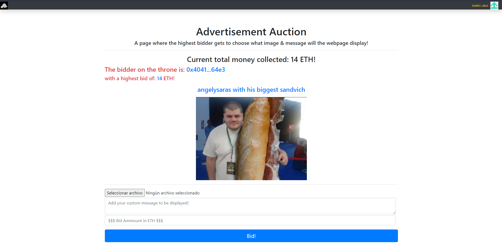

# Advertisments Auctions
A webpage where the highest bidder gets to choose what message and image is shown in the webpage.

Meant to learn blockchain technologies, made with Solidity, truffle, ganache, Web3.js, IPFS, and React.js

Inspired from this: https://ethhole.com/challenge

## How to run.

1) Install the following dependencies: Node, truffle, ganache.
2) Make sure your `truffle-config.js` is setted up with your Ganache network.
3) Execute the command: `npm i`
4) Execute the command: `truffle migrate --reset`
5) Execute the command: `npm start`

## Testing.

- Execute the command `truffle test` to run the tests.
